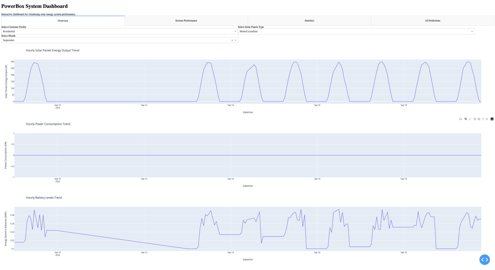

# PowerBox Project

## Overview

The high cost of importation and capital costs of imported renewable energy systems are restricting access to products that would give consumers the options they need to adopt affordable solutions that suit their needs. There is thus a need to lower the costs of such systems through local innovation and production. 

This project aims to develop a solar + wind powered **PowerBox** that can power basic appliances in the homes of low and medium-class families and micro and small businesses. A key challenge of this project is the product's affordability to the targeted group. 

This project builds on the results of engagement with an existing prototype created from past research development works. Feedback from engagement includes the need for increased power output without losing the affordability factor and a more practical body design.




## Repository Structure

The repository is structured as follows:

### Directory Descriptions

- **Clean_data/**: This folder contains the processed datasets that have been cleaned and are ready for analysis or visualization.
- **Dashboard/**: This directory holds the interactive dashboard application built with Dash, which visualizes the processed data.
- **Exploration/**: Contains Jupyter notebooks or scripts for exploring and analyzing the raw data.
- **Raw_data/**: This folder is where the original, unprocessed data files are stored.
- **Scripts/**: This contains Python scripts used for data processing, cleaning, and preparing the data for analysis.

## Steps to Replicate and Run the Project

To replicate and run the PowerBox project, follow these steps:

### 1. Clone the Repository

Clone the repository to your local machine using the following command:

```bash
git clone https://github.com/yourusername/PowerBox.git
